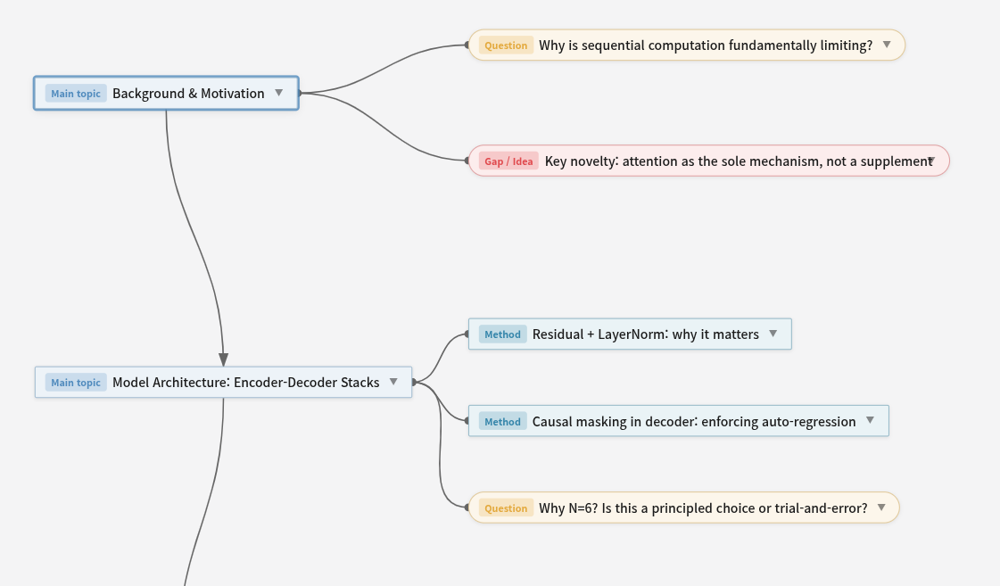
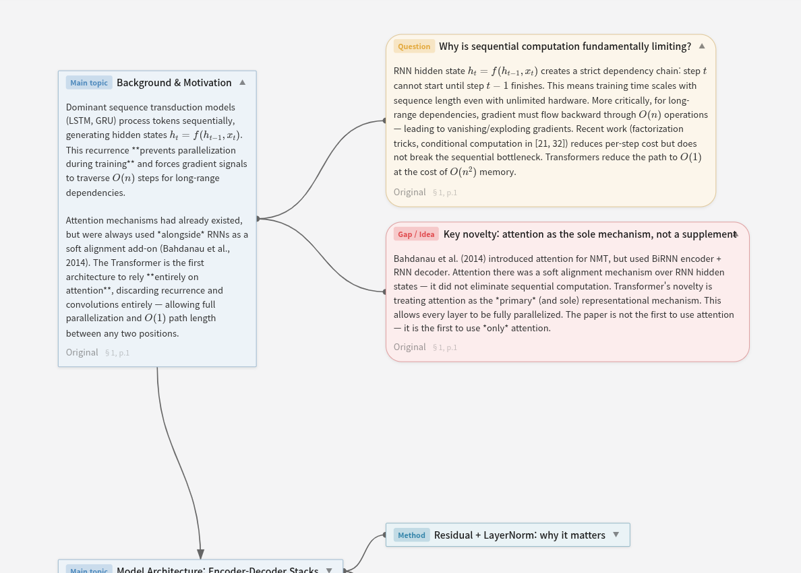

# NodeGraph

A VS Code extension for building node-based knowledge graphs from research papers and documents. Open any `.nodegraph.json` file to get an interactive canvas with rich content nodes, wires, and an exportable HTML viewer.

## Screenshots

<table>
<tr>
<td></td>
<td></td>
</tr>
<tr>
<td align="center"><sub>Graph overview — collapsed nodes with bus-routed wires</sub></td>
<td align="center"><sub>Expanded nodes — KaTeX math, original quotes, node types</sub></td>
</tr>
</table>

## Features

- **Custom editor** for `.nodegraph.json` files — pan, zoom, drag nodes
- **Rich node content** — Markdown tables, LaTeX (KaTeX), inline images
- **Node types** — Main topic, Method, Result, Claim, Question, Gap/Idea, Reference, Memo
- **Image support** — paste or drag images directly onto a node; stored as `[[IMG:filename:WxH]]` tokens
- **Expand / Collapse** — fold individual nodes or entire subtrees with one click
- **HTML export** — generate a self-contained HTML viewer (toolbar → Export HTML)
- **Toggle sections** — collapsible sub-sections inside each node
- **Original text** — attach the original source quote alongside your summary
- **Edge types** — `arrow` (causal flow) or `line` (reference / association)
- **Transitive reduction** — Reduce Edges button removes redundant A→C when A→B→C exists
- **Undo / Redo** — full history with `Ctrl+Z` / `Ctrl+Y`
- **Auto-save** — `Ctrl+S` writes to disk immediately

## Getting Started

1. Install the `.vsix` from the Releases page (or build from source).
2. Run **NodeGraph: New Graph** (`Ctrl+Shift+P`) to create a new `.nodegraph.json` file.
3. The custom editor opens automatically for any `*.nodegraph.json` file.
4. Click a node header to select it; drag to reposition.
5. Use the toolbar buttons — **Expand↓ / Collapse↑ / Fit View / Reduce Edges / Export HTML**.

## Node Content Syntax

| Feature | Syntax |
|---------|--------|
| Markdown table | `\| col \| col \|` (GFM style) |
| Inline LaTeX | `$formula$` |
| Block LaTeX | `$$formula$$` |
| Image token | `[[IMG:filename.png:400x300]]` |

Images are stored in a `.<graphname>-imgs/` folder next to the JSON file.

## File Format

```jsonc
{
  "version": "1.0.0",
  "title": "My Research Graph",
  "source": {
    "pdf": "paper.pdf",
    "authors": "Author et al.",
    "venue": "NeurIPS 2017",
    "doi": "arXiv:1706.03762"
  },
  "nodeTemplates": {
    "main_topic": { "label": "Main topic", "color": "#4B8BBE", "icon": "file-text", "shape": "sharp" },
    "question":   { "label": "Question",   "color": "#E5A835", "icon": "help-circle", "shape": "rounded" }
  },
  "nodes": [
    {
      "id": "node_001",
      "template": "main_topic",
      "title": "Introduction",
      "content": "Summary text with $\\LaTeX$ and\n[[IMG:figure1.png:500x300]]",
      "original": { "text": "Exact quote from paper.", "location": "§1, p.1" },
      "contentExpanded": true,
      "position": { "x": 0, "y": 0 },
      "children": ["node_002"],
      "images": [],
      "links": []
    }
  ],
  "edges": [
    { "id": "edge_001", "source": "node_001", "target": "node_002", "type": "arrow", "label": "" }
  ],
  "viewport": { "x": 0, "y": 0, "zoom": 1 }
}
```

## Commands

| Command | Description |
|---------|-------------|
| `NodeGraph: New Graph` | Create a new empty graph |
| `NodeGraph: Fit to View` | Fit all nodes in the viewport |
| `NodeGraph: Expand All` | Expand all node bodies |
| `NodeGraph: Collapse All` | Collapse all node bodies |

## License

MIT
