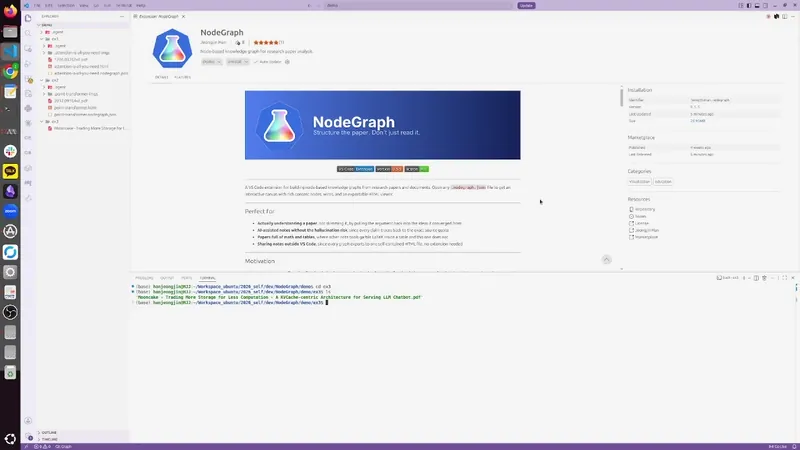

<p align="center">
  
</p>

<p align="center">
  
  
  
</p>

---

A VS Code extension for building node-based knowledge graphs from research papers and documents. Open any `.nodegraph.json` file to get an interactive canvas with rich content nodes, wires, and an exportable HTML viewer.

---

## Perfect for

- **Actually understanding a paper**, not skimming it, by pulling the argument back into the ideas it converged from
- **AI-assisted notes without the hallucination risk**, since every claim traces back to the exact source quote
- **Papers full of math and tables**, where other note tools garble LaTeX inside a table and this one does not
- **Sharing notes outside VS Code**, since every graph exports to one self-contained HTML file, no extension needed

---

## A Quick Look

<p align="center">
  
</p>
<p align="center"><b>An agent reading a paper it had never seen before and building the full nodegraph end to end, sped up — see Benchmark below for the real numbers</b></p>

---

## Motivation

Writing a paper means **diverging** first (exploring branches, dead ends, alternative framings), then **converging** that down into one clean, linear narrative. Actually dissecting a paper, understanding *why* each choice was made and not another, means running that process in reverse: pulling the converged text back apart into the diverged ideas it came from. That's naturally **a node graph, not a linear document**. That's what led to this mind-map-shaped approach in the first place.

Existing tools weren't quite it. Obsidian-style Markdown notes are great for linking ideas, but **LaTeX doesn't render inside tables**, a real blocker for papers whose comparison tables are full of notation. NodeGraph fuses what those tools do well into a single node: GFM tables, LaTeX (via KaTeX), and inline images all render together, in the same card.

It's also built around **working with an agent rather than a mouse**. Hand-placing every node as you read is tedious enough to break the flow of thought. Point an agent at the shipped `.agent/NODEGRAPH_SPEC.md` instead, and (based on the question you're currently asking it) it can decide where in the graph a new idea belongs and write the node there itself, so a conversation with an agent turns directly into structure instead of stopping to file each note by hand.

An agent writing your notes raises an obvious concern: hallucination. That's exactly what the **Original tag** exists to guard against. Every claim can carry the exact source-text quote it's grounded in, and clicking it jumps straight into the source PDF and highlights the matching sentence, so you can **verify the agent's claim against the paper in one click** instead of trusting it blindly.

And since you don't always want to be inside VS Code to revisit your own notes, every graph **exports to a single self-contained HTML file**. Open it in any browser, no extension required.

---

## Screenshots

<p align="center">
  
</p>
<p align="center"><b>Editor and exported HTML side by side — same layout, same content</b></p>

<p align="center">
  
</p>
<p align="center"><b>Debug grid and Ctrl+F search<br/>hop-level/main-topic-cluster boundaries, plus in-canvas search with matching nodes highlighted, in both the editor and the export</b></p>

<p align="center">
  
</p>
<p align="center"><b>PDF quote-jump<br/>right-click an original-text quote to open the source PDF and highlight the matching sentence (red box/arrow added for illustration)</b></p>

---

## Features

| | |
|---|---|
| **Rich node content** | Markdown (GFM) tables, LaTeX via KaTeX, inline images, and collapsible toggle sections — all with the same rich renderer |
| **Overlap-free hop layout** | Bottom-up/top-down auto-layout keyed to each main-topic's hop tree — expanding a node only grows its own branch, never disturbs siblings |
| **Smart wire routing** | A*-routed backbone wires that keep clear of node borders and spread apart when several share an endpoint; hop-child wires are direct straight lines anchored to the correct side |
| **PDF quote-jump** | Right-click an original-text quote to open the source PDF, jump to the page, and highlight the matching sentence |
| **Ctrl+F search** | BFS-ordered dropdown over titles, content, original text, and toggle sections, with inline match highlighting |
| **Debug grid** | One-click overlay of hop-level and main-topic-cluster boundaries for visually spotting layout issues |
| **HTML export** | A self-contained, interactive standalone viewer — search, highlighting, and layout included |
| **Agent-friendly** | A machine-readable spec (`.agent/NODEGRAPH_SPEC.md`) so AI agents can read and write graphs directly |

See **[FEATURES.md](docs/FEATURES.md)** for the complete feature list, organized by Editing / Layout & wires / Find & focus / Images / Files & export.

---

## Agent / AI Editing

> **Before pointing an AI agent at a project, run `NodeGraph: Copy Agent Spec to Workspace` once** — it writes `.agent/NODEGRAPH_SPEC.md` (copied from the extension bundle), `.agent/ENVIRONMENT.md` (freshly generated), and `.prompt/korean.md` / `.prompt/english.md` (ready-to-paste copies of the example prompt below, one per language) into one folder, so the agent can read all of it like any other file without needing to know the extension's install path. Right-click the target folder in the Explorer and pick it from the context menu (this is the reliable way in a multi-root workspace, or to target one specific subfolder — it writes into exactly the folder you clicked, nowhere else); running it from the Command Palette instead targets the workspace's only folder, or prompts you to pick one if there are several. It's opt-in rather than automatic on purpose: `.agent/NODEGRAPH_SPEC.md` is a large static doc identical across every install, and writing it into a folder automatically (the way `.agent/ENVIRONMENT.md` alone already does, silently, at every activation) would mean it could land in your own repo without you choosing that.
>
> **AI agents: read these two files before doing anything (both written by the command above, into the same folder):**
> 1. `.agent/NODEGRAPH_SPEC.md` — full JSON schema, syntax rules, and constraints
> 2. `.agent/ENVIRONMENT.md` — lists which Python libraries and CLI tools are installed on this machine (PDF reading, image processing, etc.)
>
> Key rules from the spec:
> - Backslashes in KaTeX **must be doubled** in JSON strings (`\\frac`, `\\sqrt`, `\\text`)
> - Prefer `$$...$$` display blocks for formulas — inline `$...$` only for short in-sentence symbols
> - Literal currency dollars must be escaped: `\$4.28/GB` (in JSON strings: `\\$4.28/GB`) — a bare `$` opens an inline-math region
> - When writing content in a non-English language, pair each key technical term with its original English form (see `.agent/NODEGRAPH_SPEC.md` for the exact convention)
> - The Killer Application is not limited to one — capture every genuinely remarkable contribution
> - `toggleItems[].content` renders exactly like `node.content` — Markdown tables, KaTeX, and `[[IMG:filename:WxH]]` tokens all work inside toggles too
> - Always update the `"modified"` timestamp after every edit

The file `.agent/NODEGRAPH_SPEC.md` (included in the extension) is a machine-readable specification for AI agents. It documents the full JSON schema, ID conventions, KaTeX/Markdown syntax rules, rendering support per field, and a step-by-step workflow for generating a nodegraph from a PDF.

A worked example is included at `demo/ex1/attention-is-all-you-need.nodegraph.json` — the full "Attention Is All You Need" paper rendered as a nodegraph with KaTeX formulas, Markdown tables, toggle sections, and deep question nodes.

**Typical agent workflow:**
1. Right-click the project folder in the Explorer and run `NodeGraph: Copy Agent Spec to Workspace` (one-time per folder)
2. Tell your agent to read `.agent/NODEGRAPH_SPEC.md` and `.agent/ENVIRONMENT.md`
3. Read or create the target `.nodegraph.json`
4. Edit the JSON directly
5. Click **Reload** in the toolbar to see the updated graph without closing/reopening the file

### Example prompt

<b>English</b> | <a href="docs/ko/README.md#example-prompt">한국어</a>

After running `NodeGraph: Copy Agent Spec to Workspace` on the folder that holds your PDF (step 1 above), paste this into your agent — fill in the path and it does the rest: reads the spec, reads the paper, and builds the graph without further back-and-forth. The same command also writes this out as `.prompt/english.md` (and a Korean version at `.prompt/korean.md`) in that folder, so you can open the file directly instead of copying it from here.

```
PDF_ABSOLUTE_PATH = <PDF_ABSOLUTE_PATH>
PROJECT_FOLDER = dirname(PDF_ABSOLUTE_PATH)

PROJECT_FOLDER/.agent/NODEGRAPH_SPEC.md and PROJECT_FOLDER/.agent/ENVIRONMENT.md
are already prepared for you — read both in full.

Based on the paper and those two files, briefly explain what kind of
nodegraph you can build from it. This extension ships a worked example
at demo/ex1/attention-is-all-you-need.nodegraph.json (inside its own
install folder) as a reference for depth/structure — check it if
useful, then build ours the same way for this paper.

Write all node content in English.

Follow the spec exactly, save the result inside PROJECT_FOLDER, and run
end to end without asking me anything. Tell me when done.
```

> **Benchmark** — an agent read the PDF, planned, and wrote each nodegraph end to end with no manual cleanup, on papers it had never seen before. Tested with Claude Code; other agentic coding tools should work the same way, since all it needs is the plain-markdown spec and prompt in `.agent`/`.prompt`:

<p align="center">
  
  
  <img src="https://img.shields.io/badge/Antigravity-ffffff?logo=&style=for-the-badge" alt="Antigravity" />
  
  
</p>

| Example | Paper | Agent | Time | Tokens |
|---|---|---|---|---|
| `demo/ex2` | [Point Transformer](https://arxiv.org/abs/2012.09164) | Opus 5 | ~16 minutes | ~65k |
| `demo/ex3` | [Mooncake](https://arxiv.org/abs/2407.00079) | Opus 5 | ~10 minutes | ~40k |

The `demo/ex3` run was recorded on **v0.5.5**, back when the example prompt still had to be copied out of this README by hand. As of **v0.6.0 and later**, `NodeGraph: Copy Agent Spec to Workspace` writes `.prompt/english.md` and `.prompt/korean.md` alongside `.agent/` from the start — point your agent at that file's path plus the PDF's path and it works the same way the recording shows, no README copy-pasting needed.

<details>
<summary>Watch the full <code>demo/ex3</code> run (40s, no sound)</summary>
<p align="center">
  <video src="https://raw.githubusercontent.com/Jeong-jin-Han/NodeGraph/main/resources/demo-ex3.mp4" controls width="100%"></video>
</p>
</details>

---

## Mouse & Keyboard Controls

<details>
<summary><b>Full control reference</b> (canvas, node, toolbar, search)</summary>

### Canvas

| Action | Control |
|--------|---------|
| Pan canvas | Left-drag on background |
| Deselect / close search | Left-click on background |
| Zoom (0.05×–8×) | Scroll wheel — centered on the cursor |
| Box-select nodes & images | Right-drag on background |
| Select node | Left-click anywhere on the node |
| Add to selection | `Shift`/`Ctrl`+click |
| **Drag node** | **Left-drag the tag badge** (e.g. "Gap / Idea") — dropping it reorders it among same-parent, same-side siblings based on where it lands, rather than just placing it at a free-form position; with a multi-selection, all selected nodes move together (without the single-node drop reordering) |
| Pin generation highlight | Click the tag badge — node + parents + children + wires turn red |
| Clear highlight / selection | `Escape` (background clicks keep the highlight) |
| Delete selection | `Delete` or `Backspace` — canvas images first, then a selected wire, then nodes |
| Select wire | Left-click a wire (turns blue) |
| Draw edge | Drag from a port dot (appears on hover) onto the other node's body, in either direction — becomes an arrow only between two Main topic nodes, a plain line otherwise |

### Node

| Action | Control |
|--------|---------|
| **Fold / Unfold content** | **Click node title** |
| **Edit node title** | **Right-click node title** |
| Edit content / original | Click text area |
| **Search original quote in PDF** | **Right-click the original-text quote** (requires `source.pdf`) |
| Add image | Copy an image, then `Ctrl+V` with the node selected or hovered — inserted as an `[[IMG:...]]` token; pasting on the background creates a floating canvas image, which can be dragged onto a node or table cell |
| Add toggle / original / link | `+ Toggle` · `+ Original` · `+ Link` buttons at the bottom of an expanded node |
| Resize node | Drag the right / bottom / corner handles of an expanded node (min 160×60) |

### Toolbar

The toolbar is two rows — editing controls on top, view/graph-navigation controls below:

| Row | Control | Description |
|-----|---------|-------------|
| Edit | Undo / Redo | History (also `Ctrl+Z` / `Ctrl+Y` / `Ctrl+Shift+Z`) |
| Edit | Template dropdown + `+ Add Node` | With exactly one node selected, adds a child of the chosen type to it (auto-positioned into the hop layout); with none or multiple selected, creates an unparented node in the nearest free spot around the view center |
| Edit | Delete | Deletes all selected nodes (shows a live count, e.g. `Delete (3)`, once more than one is selected) |
| Edit | Type & font controls | Shown while nodes are selected — switch the node's template; set font size by typing a number or picking a preset (8–72) |
| View | Collapse / Expand | Fold/unfold the selected subtree, or everything when nothing is selected — collapsing *everything* also auto-runs Fit View |
| View | Node-type filter (next to Collapse/Expand) | When set to a type instead of `None`: `Collapse` closes everything, `Expand` opens only that type's nodes and closes the rest |
| View | Fit View | Zoom to fit all nodes |
| View | Grid | Toggle the layout debug grid (hop-level vertical lines, main-topic-cluster horizontal lines) |
| View | Export HTML | Write `<name>.html` next to the JSON |
| View | Reload | Re-read the JSON from disk |
| View | Help | Open the bundled README's Features section in a Markdown preview beside the editor |

When the window is narrower than the toolbar content, both rows slide horizontally together (`Shift`+wheel or touch swipe) — button positions never change.

### Search (Ctrl+F)

| Action | Control |
|--------|---------|
| Open search | `Ctrl+F` (or `Cmd+F` on Mac) |
| Close search | `Escape` or ✕ button |
| Navigate results | `↑` / `↓` — moves dropdown highlight **and** flies viewport to that node |
| Select node | `Enter` — expands selected node, collapses other matches |
| Reopen after select | Click search input — resumes from last selected position |

Matched text inside each node is additionally marked (inverse template color + underline), so you can see *where* in the node the query appears — in the editor and in the exported HTML.

</details>

---

## Installation

Install **NodeGraph** from the [VS Code Marketplace](https://marketplace.visualstudio.com/items?itemName=JeongjinHan.nodegraph), or search "NodeGraph" in VS Code's Extensions view (`Ctrl+Shift+X`) and click Install. A packaged `.vsix` (`packages/nodegraph-<version>.vsix`) is also available in this repo if you'd rather install that directly.

<details>
<summary><b>Getting started</b></summary>

1. Run **NodeGraph: New Graph** (`Ctrl+Shift+P`) to create a `.nodegraph.json` file — or open an existing one, the custom editor opens automatically
2. **Drag nodes** by the colored tag badge; **click the title** to fold/unfold; **right-click the title** to rename it
3. Use the toolbar — **Expand / Collapse / Fit View / Export HTML / Reload / Help** — and **Ctrl+F** to search

Installing from the `.vsix` directly:

```bash
code --install-extension packages/nodegraph-<version>.vsix
```

To build the `.vsix` yourself:

```bash
npm install
node esbuild.js --production
npx vsce package -o packages/nodegraph-<version>.vsix
```

</details>

---

## Node Content Syntax

| Feature | Syntax |
|---------|--------|
| Markdown table | `\| col \| col \|` (GFM style) |
| Inline LaTeX | `$formula$` |
| Block LaTeX | `$$formula$$` |
| Bold | `**text**` (markers hidden when rendered) |
| Literal dollar (currency) | `\$` — a bare `$` would open an inline-math region (in JSON strings write `\\$`) |
| Image token | `[[IMG:filename.png:400x300]]` |

Images are stored in a `.<graphname>-imgs/` folder next to the JSON file.

---

## File Format

<details>
<summary><b>Full JSON schema example</b></summary>

```jsonc
{
  "version": "1.0.0",
  "title": "My Research Graph",
  "created": "2026-07-06T00:00:00.000Z",
  "modified": "2026-07-06T00:00:00.000Z",
  "source": {                             // optional — omit entirely if there's no source PDF
    "pdf": "paper.pdf",
    "authors": "Author et al.",
    "venue": "NeurIPS 2017",
    "doi": "arXiv:1706.03762",
    "pages": 15
  },
  "nodeTemplates": {
    "main_topic": { "label": "Main topic", "color": "#4B8BBE", "icon": "file-text", "shape": "sharp" },
    "question":   { "label": "Question",   "color": "#E5A835", "icon": "help-circle", "shape": "rounded" }
  },
  "nodes": [
    {
      "id": "node_001",
      "template": "main_topic",
      "title": "Introduction",
      "content": "Summary text with $\\LaTeX$ and\n[[IMG:figure1.png:500x300]]",
      "original": { "title": "Optional custom label", "text": "Exact quote from paper.", "location": "§1, p.1" },
      "toggleItems": [                    // optional — omit if the node has no toggle sections
        { "id": "toggle_001", "title": "Table 1", "content": "| Col | Val |\n|-----|-----|\n| A | 1 |", "expanded": false }
      ],
      "contentExpanded": true,
      "originalExpanded": false,
      "childrenExpanded": false,
      "position": { "x": 0, "y": 0 },
      "children": ["node_002"],
      "links": [],                        // { type: 'url'|'pdf'|'obsidian'|'internal', target, label }[]
      "fontSize": 14,                     // optional — per-node title font size override
      "nodeWidth": 432,                   // optional — persisted card width after a manual resize
      "nodeHeight": 220,                  // optional — persisted card height after a manual resize
      "nodeNaturalY": 0                   // optional — Y position as last set by dragging; leave this to the editor
    }
  ],
  "edges": [
    { "id": "edge_001", "source": "node_001", "target": "node_002", "type": "arrow", "label": "" },
    { "id": "edge_002", "source": "node_002", "target": "node_003", "type": "line", "label": "" }
  ],
  "viewport": { "x": 0, "y": 0, "zoom": 1 },
  "canvasImages": []                      // optional — floating images pasted onto the background, not into a node
}
```

</details>

---

## Commands

| Command | Shortcut | Description |
|---------|----------|-------------|
| `NodeGraph: New Graph` | — | Create a new empty graph. Right-click a folder in the Explorer to target it directly; from the Command Palette it targets the workspace's only folder, or prompts you to pick one if there are several |
| `NodeGraph: Search Nodes` | `Ctrl+F` / `Cmd+F` | Open search dropdown |
| `NodeGraph: Copy Agent Spec to Workspace` | — | Write `.agent/NODEGRAPH_SPEC.md`, `.agent/ENVIRONMENT.md`, and `.prompt/{korean,english}.md` into a folder so an AI agent can read them. Same folder-targeting as New Graph above |

---

## Tech Stack

| Layer | Technology |
|---|---|
| Platform | VS Code Extension (Custom Editor API) |
| UI | React + TypeScript |
| Math / rendering | KaTeX, custom Markdown-lite renderer, SVG wire routing (A*) |
| PDF | `pdfjs-dist` (custom minimal renderer, not the prebuilt viewer toolkit) |
| Build | esbuild |
| Storage | Plain JSON on disk (`.nodegraph.json`) — no accounts, no external services |

---

## Privacy

NodeGraph does **not** collect, store, or transmit any data to external servers.

- Everything lives in the `.nodegraph.json` file and local image assets next to it — no accounts, no telemetry, no analytics
- The editor loads KaTeX from the extension's own bundled assets (no CDN, no network)
- The one exception: opening an **exported HTML file** in a browser loads KaTeX from a CDN, since that file is meant to be viewed outside VS Code — the editor itself never does this
