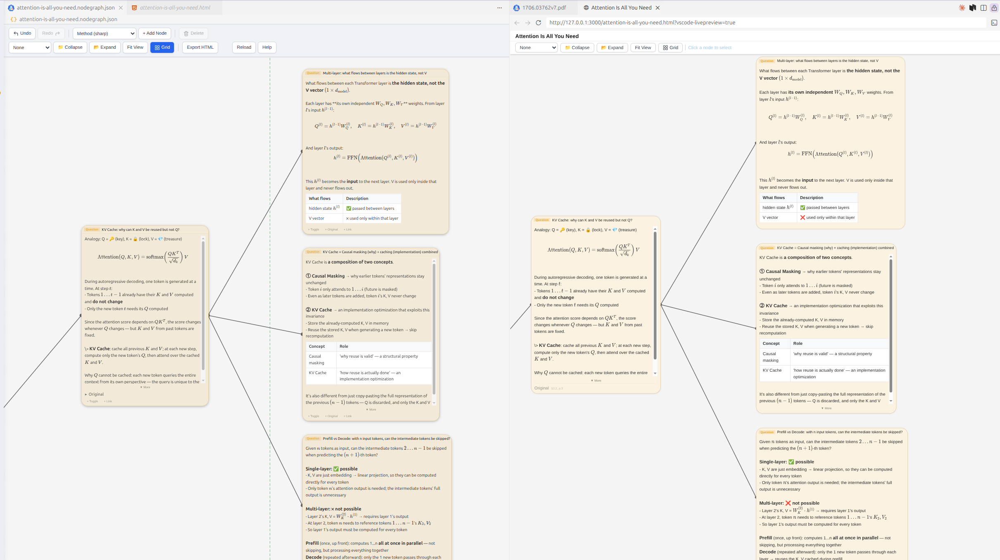
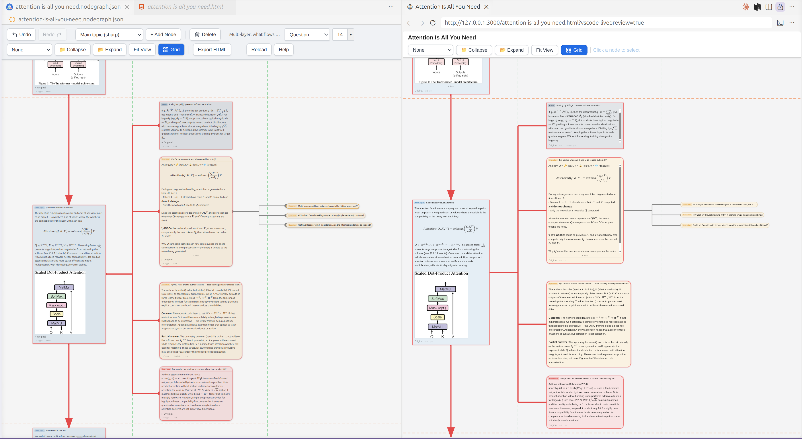
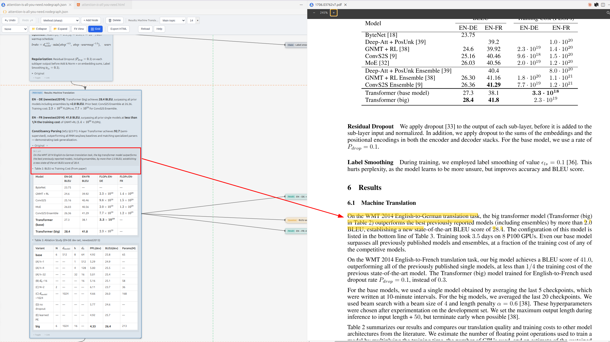

<p align="center">
  
</p>

<p align="center">
  
  
  
</p>

---

A VS Code extension for building node-based knowledge graphs from research papers and documents. Open any `.nodegraph.json` file to get an interactive canvas with rich content nodes, wires, and an exportable HTML viewer.

---

## Screenshots

<p align="center">
  
</p>
<p align="center"><sub>Editor and exported HTML side by side — same layout, same content</sub></p>

<p align="center">
  
</p>
<p align="center"><sub>Debug grid — hop-level and main-topic-cluster boundaries, in both the editor and the export</sub></p>

<p align="center">
  
</p>
<p align="center"><sub>PDF quote-jump — right-click an original-text quote to open the source PDF and highlight the matching sentence</sub></p>

---

## Features

| | |
|---|---|
| **Rich node content** | Markdown (GFM) tables, LaTeX via KaTeX, inline images, and collapsible toggle sections — all with the same rich renderer |
| **Overlap-free hop layout** | Bottom-up/top-down auto-layout keyed to each main-topic's hop tree — expanding a node only grows its own branch, never disturbs siblings |
| **Smart wire routing** | A*-routed wires that keep clear of node borders and bundle into a single trunk when several targets share a source |
| **PDF quote-jump** | Right-click an original-text quote to open the source PDF, jump to the page, and highlight the matching sentence |
| **Ctrl+F search** | BFS-ordered dropdown over titles, content, original text, and toggle sections, with inline match highlighting |
| **Debug grid** | One-click overlay of hop-level and main-topic-cluster boundaries for visually spotting layout issues |
| **HTML export** | A self-contained, interactive standalone viewer — search, highlighting, and layout included |
| **Agent-friendly** | A machine-readable spec (`.agent/NODEGRAPH_SPEC.md`) so AI agents can read and write graphs directly |

<details>
<summary><b>Full feature list</b></summary>

### Editing
- **Custom editor** for `.nodegraph.json` files — pan (left-drag), zoom (scroll wheel, 0.05×–8×, centered on the cursor), box-select (right-drag)
- **Rich node content** — Markdown (GFM) tables, LaTeX via KaTeX, `**bold**`, inline images; click any text to edit it in place (`Esc` cancels, clicking elsewhere commits)
- **Content height cap** — a node's main content (not toggles) is capped at a default max-height with a vertical scrollbar past that; a table or image that needs more room raises the cap to fit it fully instead of clipping it. A `▼ More` / `▲ Less` button appears whenever there's more to see, to view the full content uncapped — this state is per-session (resets on reload)
- **Node types** — 8 templates: Main topic, Method, Result, Claim (sharp = from the paper) and Question, Gap/Idea, Reference, Memo (rounded = your own notes); change a selected node's type from the toolbar dropdown
- **Fold / Unfold** — click the node title; toolbar `📁 Collapse` / `📂 Expand` act on the selected node's whole subtree (expand stops at other main-topic nodes), or on every node when nothing is selected; a node-type filter dropdown next to these buttons restricts them to one template — `Collapse` always closes everything, `Expand` opens only nodes of that type (ignoring parent/child relationships) and closes the rest. Collapsing *everything* (nothing selected) also auto-runs Fit View, since the graph just got much smaller
- **Toggle sections** — collapsible sub-sections inside a node (`+ Toggle` button); same rich rendering as the main content (GFM tables, LaTeX, inline images)
- **Original text** — verbatim source quote with an editable label and `§, p.` location (`+ Original` button); rendered in italics below the content; right-click the quote to jump to and highlight it in the source PDF (see **Find & focus**)
- **Links** — attach `url` / `pdf` / `obsidian` links to a node (`+ Link` button); click to open — PDFs are resolved relative to the JSON file
- **Edges** — drag from a port dot (appears on hover) onto any node body to connect two nodes, in either direction; the type is chosen automatically (an arrow only between two Main topic nodes — the backbone sequence — a plain line otherwise); duplicates are ignored; click a wire to select it (blue) and press `Delete` to remove it (transitively redundant A→C edges are expected to be avoided when the graph is written — see Agent / AI Editing). Connecting a node that doesn't have a parent yet also gives it an initial hop-based position: a direct child of a main-topic node fans out to that node's right (or left, once the right side has 4) around its vertical center, and anything deeper keeps extending the same direction its parent already went
- **Resize & typography** — drag an expanded node's right/bottom/corner handles (min 160×60); nodes widen automatically to fit tables and sized images; per-node font size 8–72px via the toolbar combo (with multiple nodes selected, sizes shift together preserving differences)
- **Undo / Redo** — full history with `Ctrl+Z` / `Ctrl+Y` (or `Ctrl+Shift+Z`)

### Layout & wires
- **Overlap-free layout** — saved positions are never rewritten by the layout; at render time each main-topic node and its whole hop tree is treated as one group, laid out bottom-up (each subtree's needed space computed from its leaves first) then positioned top-down in one pass, so expanding a node only grows its own group's space — other main-topic groups shift down to make room instead of every node individually re-packing against its neighbors. Horizontally, every node at the same hop level (hop-1, hop-2, ...) stays aligned to the same X across the whole graph — if one branch needs a wider column (e.g. a table), the whole hop-level column shifts out together rather than drifting out of alignment with sibling branches. Nodes also push apart sideways (60px minimum) when widened by a table, and everything returns to place when folded. The exported HTML viewer uses this same layout algorithm.
- **Smart wire routing** — wires are planned on a 24px cost grid (A*): node interiors are heavily penalized (crossed only when a node is fully enclosed), wires keep clearance from node borders and spread into free space instead of stacking; while dragging a node a light heuristic keeps rendering smooth and the precise routes return 150ms after the layout settles
- **Zoom-stable line weight** — wires, arrowheads, and the debug grid keep their base thickness once you're zoomed in (≥100%), but thicken as you zoom out below 100% so they stay readable instead of fading to hairlines
- **Layout debug grid (`Grid`)** — toggles an overlay of dashed boundary lines: vertical lines mark hop-level boundaries (main topic / hop-1 / hop-2 / ...), horizontal lines mark each main-topic cluster's extent. Useful for visually spotting layout/spacing issues

### Find & focus
- **Ctrl+F search** — live dropdown over title, content, original text (including its custom label), and toggle-section titles/content, ordered by main-topic BFS (each main topic in backbone order, then all of its hop-1 matches, then all of its hop-2 matches, and so on, before moving to the next main topic); `↑`/`↓` flies the viewport to each match, `Enter` expands the chosen node (and its Original section / any toggle sections the match falls inside) and collapses the other matches; the matched text itself is marked inside the node in the inverse of its template color
- **Generation highlight** — click a node's tag badge to outline the node, its parents/children, and the connecting wires in red; background clicks keep it pinned, `Esc` clears it
- **Search original text in the source PDF** — right-click an expanded node's original-text quote to open (or reuse) a built-in PDF viewer tab for the graph's `source.pdf`, jump to the page from the quote's `p.N` location, and highlight the matching sentence in **yellow** (exact match first, word-overlap fuzzy match as a fallback for OCR/hyphenation drift); if no text match is found nearby it still lands on the hinted page. Requires `source.pdf` to be set on the graph. `Esc` inside the PDF tab clears the highlight.
- **Find and zoom inside the PDF viewer** — the built-in PDF tab has its own toolbar: `−`/`+` zoom (50%–400%, re-renders at the new scale without losing your scroll position), and a magnifying-glass find button (or `Ctrl+F`/`Cmd+F` inside the tab) that opens a find bar to search the whole document — `↑`/`↓` (or `Enter`/`Shift+Enter`) step through matches, a counter shows `N of M`, and matches highlight in **orange** so they're never confused with the yellow quote-jump highlight. `Esc` closes the find bar.

### Images
- **Paste into a node** — copy any image and press `Ctrl+V` with a node selected or hovered (or inside the content editor or a toggle's editor, at the cursor); the file is saved as `img_<timestamp>.<ext>` in `.<name>-imgs/` and referenced as an `[[IMG:filename:WxH]]` token; pasting right after a table row's closing `|` drops the image below the table instead of corrupting the row
- **Canvas images** — paste on the background to get a floating, draggable, aspect-preserving-resizable image; drop it onto a node (or a specific table cell) to move it into that content; `Ctrl+C`/`X`/`V` copies, cuts, and clones canvas images
- **Lightbox** — click any image to zoom it full-screen; `Esc` or a click closes

### Files & export
- **Empty file → empty graph** — opening a blank (0-byte) or otherwise unparsable `.nodegraph.json` shows an empty, editable graph instead of a blank screen; no need to pre-populate the JSON (via an agent or `NodeGraph: New Graph`) before the editor works
- **HTML export** — writes a self-contained `<name>.html` next to the JSON with all referenced images inlined as base64 and offers *Open in Browser / Show in Explorer*; the viewer reproduces the same hop-tree layout algorithm as the editor (overlap-free, hop-level X alignment), the content height cap with its `▼ More` / `▲ Less` toggle, zoom-stable wire/grid line weight, Ctrl+F search (BFS-ordered, matching title/content/original/toggles, auto-expanding the Original section or toggle a match falls inside) with inline marks, generation highlight, wire routing, the debug grid, the fold layout (Collapse/Expand, with the same node-type filter and collapse-everything-auto-fits-view behavior as the editor toolbar), node dragging, and window-resize recentering (KaTeX loads from a CDN, so formulas need internet; floating canvas images are not exported)
- **Save** — `Ctrl+S` writes pretty-printed JSON to disk immediately; image insertion saves automatically
- **External edits** — when the file changes outside the webview the graph reloads automatically; `Reload` force-re-reads from disk (useful after an AI agent edits the JSON)
- **Slidable toolbar** — on narrow windows the toolbar keeps its button positions and slides horizontally (`Shift`+wheel on desktop, swipe on touch)
- **Theme-independent canvas** — canvas background, node colors, text, links, and inputs are all snapshotted from the active VSCode theme when the webview first loads, and stay fixed after that even if you switch themes
- **Help** — the `Help` toolbar button opens the extension's bundled README, scrolled to the Features section

</details>

---

## Agent / AI Editing

> **Before pointing an AI agent at a project, run `NodeGraph: Copy Agent Spec to Workspace` once** — it writes both `.agent/NODEGRAPH_SPEC.md` (copied from the extension bundle) and `.agent/ENVIRONMENT.md` (freshly generated) into one folder, so the agent can read both like any other file without needing to know the extension's install path. Right-click the target folder in the Explorer and pick it from the context menu (this is the reliable way in a multi-root workspace, or to target one specific subfolder — it writes into exactly the folder you clicked, nowhere else); running it from the Command Palette instead targets the workspace's only folder, or prompts you to pick one if there are several. It's opt-in rather than automatic on purpose: `.agent/NODEGRAPH_SPEC.md` is a large static doc identical across every install, and writing it into a folder automatically (the way `.agent/ENVIRONMENT.md` alone already does, silently, at every activation) would mean it could land in your own repo without you choosing that.
>
> **AI agents: read these two files before doing anything (both written by the command above, into the same folder):**
> 1. `.agent/NODEGRAPH_SPEC.md` — full JSON schema, syntax rules, and constraints
> 2. `.agent/ENVIRONMENT.md` — lists which Python libraries and CLI tools are installed on this machine (PDF reading, image processing, etc.)
>
> Key rules from the spec:
> - Backslashes in KaTeX **must be doubled** in JSON strings (`\\frac`, `\\sqrt`, `\\text`)
> - Prefer `$$...$$` display blocks for formulas — inline `$...$` only for short in-sentence symbols
> - Literal currency dollars must be escaped: `\$4.28/GB` (in JSON strings: `\\$4.28/GB`) — a bare `$` opens an inline-math region
> - When writing content in a non-English language, pair each key technical term with its original English form (see `.agent/NODEGRAPH_SPEC.md` for the exact convention)
> - The Killer Application is not limited to one — capture every genuinely remarkable contribution
> - `toggleItems[].content` renders exactly like `node.content` — Markdown tables, KaTeX, and `[[IMG:filename:WxH]]` tokens all work inside toggles too
> - Always update the `"modified"` timestamp after every edit

The file `.agent/NODEGRAPH_SPEC.md` (included in the extension) is a machine-readable specification for AI agents. It documents the full JSON schema, ID conventions, KaTeX/Markdown syntax rules, rendering support per field, and a step-by-step workflow for generating a nodegraph from a PDF.

A worked example is included at `demo/ex1/attention-is-all-you-need.nodegraph.json` — the full "Attention Is All You Need" paper rendered as a nodegraph with KaTeX formulas, Markdown tables, toggle sections, and deep question nodes.

**Typical agent workflow:**
1. Right-click the project folder in the Explorer and run `NodeGraph: Copy Agent Spec to Workspace` (one-time per folder)
2. Tell your agent to read `.agent/NODEGRAPH_SPEC.md` and `.agent/ENVIRONMENT.md`
3. Read or create the target `.nodegraph.json`
4. Edit the JSON directly
5. Click **Reload** in the toolbar to see the updated graph without closing/reopening the file

### Example prompt

<b>English</b> | <a href="docs/ko/README.md#example-prompt">한국어</a>

After running `NodeGraph: Copy Agent Spec to Workspace` on the folder that holds your PDF (step 1 above), paste this into your agent — fill in the path and it does the rest: reads the spec, reads the paper, and builds the graph without further back-and-forth.

```
PDF_ABSOLUTE_PATH = <PDF_ABSOLUTE_PATH>
PROJECT_FOLDER = dirname(PDF_ABSOLUTE_PATH)

PROJECT_FOLDER/.agent/NODEGRAPH_SPEC.md and PROJECT_FOLDER/.agent/ENVIRONMENT.md
are already prepared for you — read both in full.

Based on the paper and those two files, briefly explain what kind of
nodegraph you can build from it. This extension ships a worked example
at demo/ex1/attention-is-all-you-need.nodegraph.json (inside its own
install folder) as a reference for depth/structure — check it if
useful, then build ours the same way for this paper.

Write all node content in English.

Follow the spec exactly, save the result inside PROJECT_FOLDER, and run
end to end without asking me anything. Tell me when done.
```

> **Benchmark** — on `demo/ex2` (a paper the graph had never seen before), Claude Opus 5 read the PDF, planned, and wrote the full nodegraph in **~16 minutes** using **~65k tokens**, no manual cleanup needed afterward.

---

## Mouse & Keyboard Controls

<details>
<summary><b>Full control reference</b> (canvas, node, toolbar, search)</summary>

### Canvas

| Action | Control |
|--------|---------|
| Pan canvas | Left-drag on background |
| Deselect / close search | Left-click on background |
| Zoom (0.05×–8×) | Scroll wheel — centered on the cursor |
| Box-select nodes & images | Right-drag on background |
| Select node | Left-click anywhere on the node |
| Add to selection | `Shift`/`Ctrl`+click |
| **Drag node** | **Left-drag the tag badge** (e.g. "Gap / Idea"); with a multi-selection, all selected nodes move together |
| Pin generation highlight | Click the tag badge — node + parents + children + wires turn red |
| Clear highlight / selection | `Escape` (background clicks keep the highlight) |
| Delete selection | `Delete` or `Backspace` — canvas images first, then a selected wire, then nodes |
| Select wire | Left-click a wire (turns blue) |
| Draw edge | Drag from a port dot (appears on hover) onto the other node's body, in either direction — becomes an arrow only between two Main topic nodes, a plain line otherwise |

### Node

| Action | Control |
|--------|---------|
| **Fold / Unfold content** | **Click node title** |
| **Edit node title** | **Right-click node title** |
| Edit content / original | Click text area |
| **Search original quote in PDF** | **Right-click the original-text quote** (requires `source.pdf`) |
| Add image | Copy an image, then `Ctrl+V` with the node selected or hovered — inserted as an `[[IMG:...]]` token; pasting on the background creates a floating canvas image, which can be dragged onto a node or table cell |
| Add toggle / original / link | `+ Toggle` · `+ Original` · `+ Link` buttons at the bottom of an expanded node |
| Resize node | Drag the right / bottom / corner handles of an expanded node (min 160×60) |

### Toolbar

The toolbar is two rows — editing controls on top, view/graph-navigation controls below:

| Row | Control | Description |
|-----|---------|-------------|
| Edit | Undo / Redo | History (also `Ctrl+Z` / `Ctrl+Y` / `Ctrl+Shift+Z`) |
| Edit | Template dropdown + `+ Add Node` | With exactly one node selected, adds a child of the chosen type to it (auto-positioned into the hop layout); with none or multiple selected, creates an unparented node in the nearest free spot around the view center |
| Edit | Delete | Deletes all selected nodes (shows a live count, e.g. `Delete (3)`, once more than one is selected) |
| Edit | Type & font controls | Shown while nodes are selected — switch the node's template; set font size by typing a number or picking a preset (8–72) |
| View | Collapse / Expand | Fold/unfold the selected subtree, or everything when nothing is selected — collapsing *everything* also auto-runs Fit View |
| View | Node-type filter (next to Collapse/Expand) | When set to a type instead of `None`: `Collapse` closes everything, `Expand` opens only that type's nodes and closes the rest |
| View | Fit View | Zoom to fit all nodes |
| View | Grid | Toggle the layout debug grid (hop-level vertical lines, main-topic-cluster horizontal lines) |
| View | Export HTML | Write `<name>.html` next to the JSON |
| View | Reload | Re-read the JSON from disk |
| View | Help | Open the bundled README's Features section in a Markdown preview beside the editor |

When the window is narrower than the toolbar content, both rows slide horizontally together (`Shift`+wheel or touch swipe) — button positions never change.

### Search (Ctrl+F)

| Action | Control |
|--------|---------|
| Open search | `Ctrl+F` (or `Cmd+F` on Mac) |
| Close search | `Escape` or ✕ button |
| Navigate results | `↑` / `↓` — moves dropdown highlight **and** flies viewport to that node |
| Select node | `Enter` — expands selected node, collapses other matches |
| Reopen after select | Click search input — resumes from last selected position |

Matched text inside each node is additionally marked (inverse template color + underline), so you can see *where* in the node the query appears — in the editor and in the exported HTML.

</details>

---

## Installation

Install **NodeGraph** from the [VS Code Marketplace](https://marketplace.visualstudio.com/items?itemName=JeongjinHan.nodegraph), or search "NodeGraph" in VS Code's Extensions view (`Ctrl+Shift+X`) and click Install. A packaged `.vsix` (`packages/nodegraph-<version>.vsix`) is also available in this repo if you'd rather install that directly.

<details>
<summary><b>Getting started</b></summary>

1. Run **NodeGraph: New Graph** (`Ctrl+Shift+P`) to create a `.nodegraph.json` file — or open an existing one, the custom editor opens automatically
2. **Drag nodes** by the colored tag badge; **click the title** to fold/unfold; **right-click the title** to rename it
3. Use the toolbar — **Expand / Collapse / Fit View / Export HTML / Reload / Help** — and **Ctrl+F** to search

Installing from the `.vsix` directly:

```bash
code --install-extension packages/nodegraph-<version>.vsix
```

To build the `.vsix` yourself:

```bash
npm install
node esbuild.js --production
npx vsce package -o packages/nodegraph-<version>.vsix
```

</details>

---

## Node Content Syntax

| Feature | Syntax |
|---------|--------|
| Markdown table | `\| col \| col \|` (GFM style) |
| Inline LaTeX | `$formula$` |
| Block LaTeX | `$$formula$$` |
| Bold | `**text**` (markers hidden when rendered) |
| Literal dollar (currency) | `\$` — a bare `$` would open an inline-math region (in JSON strings write `\\$`) |
| Image token | `[[IMG:filename.png:400x300]]` |

Images are stored in a `.<graphname>-imgs/` folder next to the JSON file.

---

## File Format

<details>
<summary><b>Full JSON schema example</b></summary>

```jsonc
{
  "version": "1.0.0",
  "title": "My Research Graph",
  "created": "2026-07-06T00:00:00.000Z",
  "modified": "2026-07-06T00:00:00.000Z",
  "source": {
    "pdf": "paper.pdf",
    "authors": "Author et al.",
    "venue": "NeurIPS 2017",
    "doi": "arXiv:1706.03762",
    "pages": 15
  },
  "nodeTemplates": {
    "main_topic": { "label": "Main topic", "color": "#4B8BBE", "icon": "file-text", "shape": "sharp" },
    "question":   { "label": "Question",   "color": "#E5A835", "icon": "help-circle", "shape": "rounded" }
  },
  "nodes": [
    {
      "id": "node_001",
      "template": "main_topic",
      "title": "Introduction",
      "content": "Summary text with $\\LaTeX$ and\n[[IMG:figure1.png:500x300]]",
      "original": { "text": "Exact quote from paper.", "location": "§1, p.1" },
      "toggleItems": [
        { "id": "toggle_001", "title": "Table 1", "content": "| Col | Val |\n|-----|-----|\n| A | 1 |", "expanded": false }
      ],
      "contentExpanded": true,
      "originalExpanded": false,
      "childrenExpanded": false,
      "position": { "x": 0, "y": 0 },
      "children": ["node_002"],
      "links": []
    }
  ],
  "edges": [
    { "id": "edge_001", "source": "node_001", "target": "node_002", "type": "arrow", "label": "" }
  ],
  "viewport": { "x": 0, "y": 0, "zoom": 1 }
}
```

</details>

---

## Commands

| Command | Shortcut | Description |
|---------|----------|-------------|
| `NodeGraph: New Graph` | — | Create a new empty graph. Right-click a folder in the Explorer to target it directly; from the Command Palette it targets the workspace's only folder, or prompts you to pick one if there are several |
| `NodeGraph: Search Nodes` | `Ctrl+F` / `Cmd+F` | Open search dropdown |
| `NodeGraph: Copy Agent Spec to Workspace` | — | Write `.agent/NODEGRAPH_SPEC.md` and `.agent/ENVIRONMENT.md` into a folder so an AI agent can read both. Same folder-targeting as New Graph above |

---

## Tech Stack

| Layer | Technology |
|---|---|
| Platform | VS Code Extension (Custom Editor API) |
| UI | React + TypeScript |
| Math / rendering | KaTeX, custom Markdown-lite renderer, SVG wire routing (A*) |
| PDF | `pdfjs-dist` (custom minimal renderer, not the prebuilt viewer toolkit) |
| Build | esbuild |
| Storage | Plain JSON on disk (`.nodegraph.json`) — no accounts, no external services |

---

## Privacy

NodeGraph does **not** collect, store, or transmit any data to external servers.

- Everything lives in the `.nodegraph.json` file and local image assets next to it — no accounts, no telemetry, no analytics
- The editor loads KaTeX from the extension's own bundled assets (no CDN, no network)
- The one exception: opening an **exported HTML file** in a browser loads KaTeX from a CDN, since that file is meant to be viewed outside VS Code — the editor itself never does this
